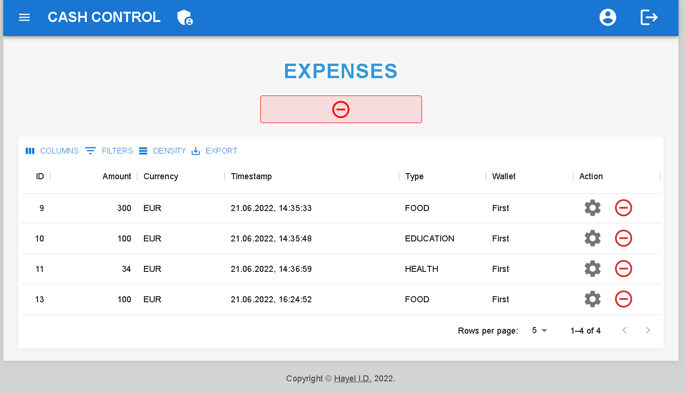

<h1 align="center">TeachMeSkills Final Project</h1>
<h2 align="center">💵 Cash Control Application</h2>

[](https://www.repostatus.org/#wip)
[](https://github.com/IvanHayel/cash-control-application/blob/master/LICENSE.md)
[](https://www.codacy.com/gh/IvanHayel/cash-control-application/dashboard?utm_source=github.com&amp;utm_medium=referral&amp;utm_content=IvanHayel/cash-control-application&amp;utm_campaign=Badge_Grade)
[](https://github.com/IvanHayel/cash-control-application/issues)
[](http://hits.dwyl.com/IvanHayel/cash-control-application)
[](https://github.com/IvanHayel)
<!-- TABLE OF CONTENTS -->
<details>
  <summary style="font-weight: bold; font-size: large">Table of Contents</summary>
  <ol>
    <li>
      <a href="#-about-the-project">About The Project</a>
      <ul>
        <li><a href="#-main-technologies">Main Technologies</a></li>
      </ul>
    </li>
    <li>
      <a href="#%EF%B8%8F-getting-started">Getting Started</a>
      <ul>
        <li><a href="#basic">Basic</a></li>
        <li><a href="#-docker">Docker</a></li>
        <li><a href="#-root-credentials">Root credentials</a></li>
      </ul>
    </li>
    <li>
        <a href="#-demo">Demo</a>
        <ul>
            <li><a href="#sign-in">Sign in</a></li>
            <li><a href="#sign-up">Sign up</a></li>
            <li><a href="#side-menu">Side menu</a></li>
            <li><a href="#admin-board">Admin board</a></li>
            <li><a href="#incomes">Incomes</a></li>
            <li><a href="#expenses">Expenses</a></li>
            <li><a href="#transfers">Transfers</a></li>
            <li><a href="#helpful-toasts">Helpful toasts</a></li>
            <li><a href="#reports-beta-version">Reports (BETA)</a></li>
        </ul>
    </li>
    <li><a href="#-future-updates">Future updates</a></li>
  </ol>
</details>

## 📄 About The Project

> Full Stack web application to control the cash flow.


### 📝 Main Technologies

| **Database** |                                                                                                                                   [](https://www.postgresql.org/)                                                                                                                                   |
|:------------:|:-------------------------------------------------------------------------------------------------------------------------------------------------------------------------------------------------------------------------------------------------------------------------------------------------------------------------------------------------------------------------------------------------------------------------:|
| **Backend**  |                                                                              [](https://dev.java/) [](https://spring.io/)                                                                               |
| **Frontend** | [](https://www.javascript.com/) [](https://reactjs.org/) [](https://mui.com/) |
| **Security** |                                                                                                                                                      [](https://jwt.io/)                                                                                                                                                       |

--- 

## ⚙️ Getting Started

To get a local copy up and running follow these simple steps.

* Clone the repository

```console
git clone https://github.com/IvanHayel/cash-control-application.git
```

* Create PostgreSQL database

```sql
CREATE DATABASE cash_control
    WITH 
    OWNER = postgres
    ENCODING = 'UTF8'
    LC_COLLATE = 'English_World.1252'
    LC_CTYPE = 'English_World.1252'
    TABLESPACE = pg_default
    CONNECTION LIMIT = -1;
```

<h3 align="center">Basic</h3>

#### Frontend
> You can use `npm` or `yarn`.

1. Move to the `cash-control-client` folder and install dependencies

```console
yarn install
```

2. Run the application

```console
yarn run start
```

#### Backend

> Java version 17+ is required.

1. Move to the `cash-control-server` folder and just run spring-boot application

```console
mvn spring-boot:run
```

<h3 align="center">🐋 Docker</h3>

Application can be run in `Docker` container.

1. Package the application with `Maven` to `jar` file
```console
mvn clean package
```
or with skipping tests
```console
mvn clean package -DskipTests
```

2. Use `docker-compose` in root folder to run the application
```console
docker-compose up
```

<h3 align="center">🔑 Root credentials</h3>

### Username: `root`
### Password: `root3301`

---

## 🪄 Demo

### Sign in


### Sign up


### Side menu


### Admin board


### Wallets


### Incomes


### Expenses



### Transfers


### Helpful toasts


### Reports `BETA VERSION`


---

## 💡 Future updates

- [ ] **Full reports**
- [ ] **Code refactoring**
- [ ] **Test coverage**
- [ ] **Email notifications**
- [ ] **Heroku deployment**